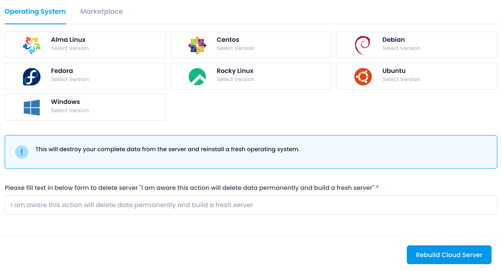

Utho's resize plans allow users to upgrade or downgrade their cloud server's resources by selecting from predefined plans.

### **Rebuild  Cloud**

**Rebuilding** a server in the cloud refers to the process of restoring or replacing a cloud instance (virtual machine) with a new configuration or image, usually to fix issues, apply a fresh OS installation, or modify the server's specifications. It can be done without fully deleting the server, as cloud providers allow the creation of a new instance from the same template or snapshot, keeping data integrity intact when needed.

### **Benefits of Rebuilding in Cloud** :

1. **Quick Recovery** : If a server has issues (e.g., OS corruption, misconfiguration), rebuilding it can quickly restore a functional environment without waiting for long repair processes.
2. **Fresh Configuration** : Rebuilding allows the server to be reset with a fresh configuration, clearing any previous issues and providing an opportunity to apply new system updates or configurations.
3. **Minimal Downtime** : Cloud providers typically allow for rebuilding without taking the entire infrastructure offline, reducing the impact on service availability.
4. **Cost-Effective** : Instead of manually fixing complex issues, rebuilding a server from an image or snapshot can save time and reduce troubleshooting costs.
5. **Scalability and Flexibility** : Rebuilding lets you easily scale server resources, such as CPU, RAM, or storage, by selecting a new instance type during the rebuild process.

**Utho's** Rebuild functionality allows users to completely rebuild their cloud server.

**Note** : This action will destroy all data on the server and reinstall a fresh operating system. There are two ways to rebuild the cloud server:

### 1. Using Operating System

Users can select an operating system image from the available list to reinstall on their cloud server. Refer above snippet.

### 2. Using Marketplace

Users can choose an image from the marketplace to rebuild their cloud server.Refer above snippet.

### Rebuild Process

1. **Select an Image** : Choose an image either from the operating system list or the marketplace.
2. **Input Confirmation** : Fill in the confirmation text in the provided form:
   `I am aware this action will delete data permanently and build a fresh server.`
3. **Rebuild Button** : Click the "**Rebuild Cloud Server**" button to initiate the rebuild process.

Upon confirmation and clicking the rebuild button, the server will start the rebuilding process with the selected image, resulting in a fresh installation of the operating system and complete data loss.

---
