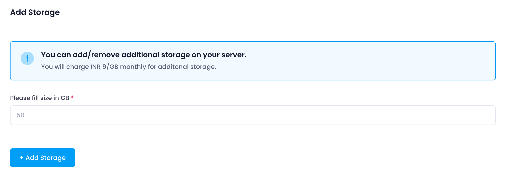

Utho's storage allows users to view and manage storage devices attached to their cloud instance on the Utho platform. This section provides detailed information about current storage and options to update or add new storage.

### Current Storage

Users can see the current storage devices attached to their server in a table format with the following information for each storage device:

* **ID** : The unique identifier for the storage device.
* **Size** : The size of the storage device in GB.
* **Bus** : The bus type of the storage device (e.g., virtio, ide).
* **Type** : The role of the storage device (primary or secondary).
* **Created At** : The date and time when the storage device was created.
* **Update** : A button to update the storage device.
* **Delete** : A button to delete the storage device.

### Updating Utho's Storage

For each storage device, users can perform the following updates:

* **Change Bus** : Users can change the bus type of the storage device between virtio and ide.
* **Change Storage Type** : Users can change the storage type from secondary to primary and vice versa. Note that there can only be one primary storage device. When a secondary storage device is promoted to primary, the current primary storage device is automatically demoted to secondary.

To update a storage device, click the **Update Button** in the respective row. This will open a form where you can select the new bus type and storage type.

### Adding Additional Storage

Users have the option to add additional storage to their cloud instance. This new storage will be assigned as secondary storage by default. To add new storage:

1. **Input Field** : Enter the desired size for the new storage in GB.
2. **Add Storage Button** : Click this button to create and attach the new storage device to your cloud instance.

Upon successful creation, the new storage device will appear in the current storage table as a secondary storage device.
